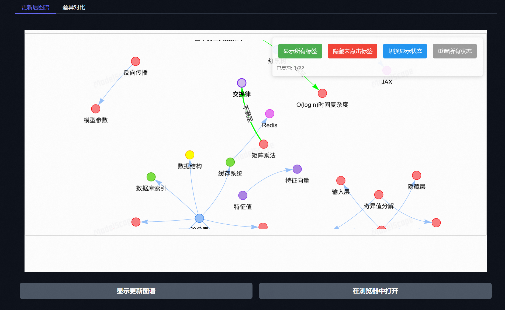
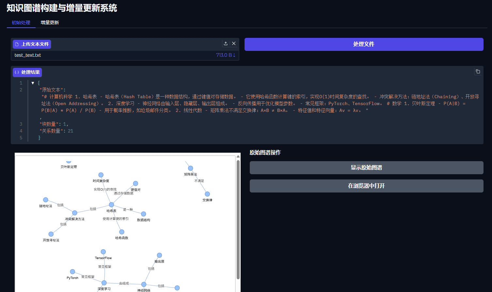
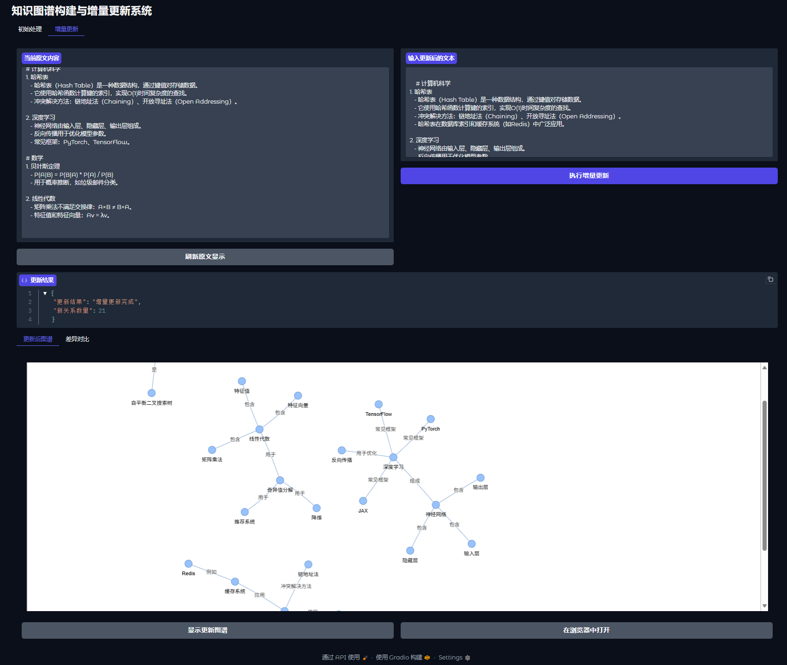
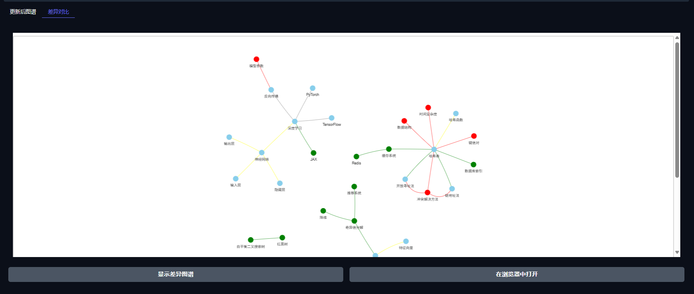

# 知识图谱构建与增量更新系统演示

## 在线体验项目
https://modelscope.cn/studios/xkj1615242125/kg-graphrag

## 项目展示
### 更新

--------------





## 知识图谱自己实现的思路

自动记录生成图谱的过程日志（时间，流程）


第一次创建图谱:
多模态文件 --> 纯文本（html或其他标记型语言方便了解笔记中的各类资源类型比如图谱img，文本text...） --> 分割成块 --> 记录块的信息
-->  提取实体 --> 提取关系 --> 知识融合 --> 一个笔记的知识图谱


图谱的增量更新:
修改笔记内容 --> 得到增删改的块 --> 提取实体 --> 关系抽取 --> 用改变的块产生的新三元组替代原本的 --> 知识融合 


笔记主要内容可视化：
提取笔记的摘要 --> 统计主要的实体 --> 可视化在笔记边


数据库內所有笔记的图谱
查询得到所有图谱的块中内容 --> 知识融合 


知识融合: 。。。


社区搜索：


多模态文件转为统一格式的纯文本：采用类似xml格式区分图片，表格，文本，链接等


## 注意 spacy 使用需要下载模型：
```bash 
   python -m spacy download zh_core_web_sm
```

## 使用说明
1. 按照所需库 pip 。。。
2. spacy 使用需要下载模型 ，执行命令即可
3. 添加自己的deepseek的key到gradio_test.py文件中，替换sk-xx
4. 运行 gradio_test.py 即可


## 修改参数
1. 调整分割的参数，如token最大数，最小数，查看命令行打印即可了解增量更新的体现


## 日志
1. gradio_test.py **给知识图谱新增功能：复习实体间关系**
   1. 鼠标点击关系即可查看，否则是隐藏可进行复习
   2. 可一键展示或隐藏所有关系
   3. 实体类型可鼠标悬停在节点上展示，同色节点为相同实体类型

2. test.py 作为测试新功能文件
   1. 新增rag功能 hybrid（图与向量） 与 local （向量）
   2. 测试向量数据库的使用 - 存储与查询